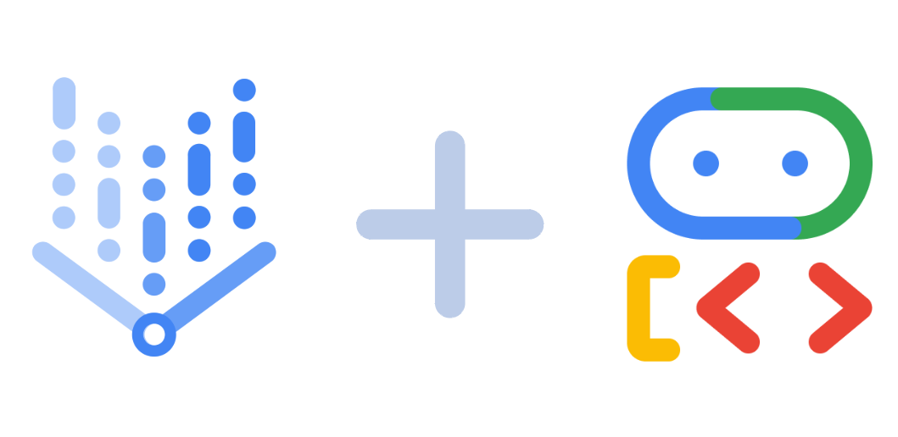
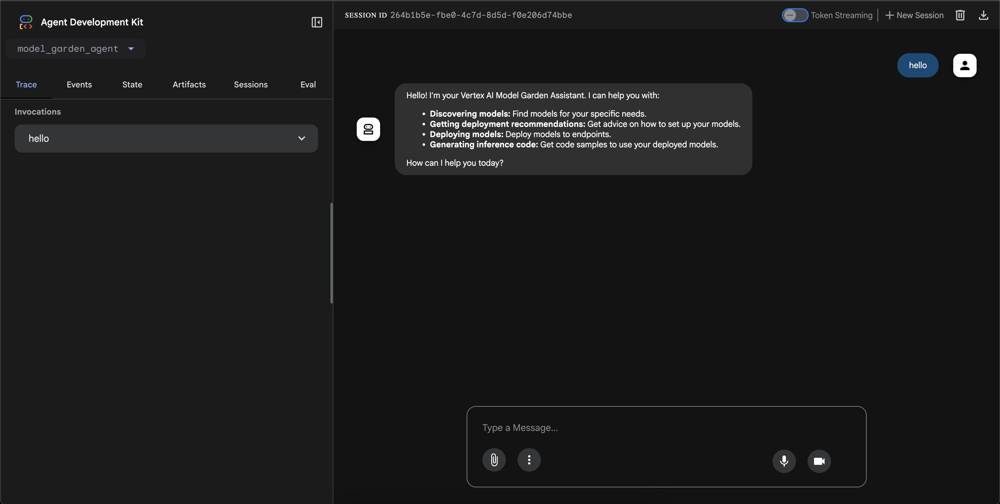

# model-garden-agent
<p align="center"> 
</p>

A chat-based AI agent for deploying generative AI models on Google Cloud Vertex AI, implemented using the [Google Agent Development Kit](https://google.github.io/adk-docs/).  
The agent is capable of interacting with users using natural language prompts and provides a more user-friendly approach to deploying LLMs on Vertex AI model garden compared to existing modes such as the Vertex AI SDKs, Vertex AI REST API, etc.

## ✨ Features
The model garden agent can assist users with the following tasks all using natural language prompts:
 - Search for deployable, open-source generative AI models on Vertex AI model Garden or HuggingFace Hub
 - List available deployment configurations for deploying a chosen model to a Vertex AI endpoint
 - Deploy a selected model to a Vertex AI managed endpoint.
 - Run inference on a deployed model.
 - Undeploy model from an Vertex AI endpoint and Delete endpoints

## 🚀 Getting Started
### Prerequisites
The following are required to set up the project:
- Python 3.10+
- Poetry (for dependency management). Install from [here](https://python-poetry.org/docs/#installation)
- A Gemini API key from [Google AI Studio](https://aistudio.google.com/app/apikey)
- A Google Cloud Project with Vertex AI API enabled. See [this guide](https://cloud.google.com/resource-manager/docs/creating-managing-projects) for guidance.
- `gcloud` CLI for authenticating Google Cloud project. Install from [here](https://cloud.google.com/sdk/docs/install)


### Installation
1.  **Clone the repository:**
    ```sh
    git clone https://github.com/francis-ohara/model-garden-agent.git
    cd model-garden-agent
    ```

2.  **Install dependencies using Poetry:**
    ```sh
    poetry install
    ```

3.  **Set up environment variables:**
    - copy `.env.example` template to  `.env`
    ```sh
    cd src/model_garden_agent
    cp .env.example .env
    ```

     - Add the necessary environment variables to the `.env` file  
    ```
    GOOGLE_GENAI_USE_VERTEXAI=FALSE
    GOOGLE_API_KEY=PASTE_YOUR_ACTUAL_API_KEY_HERE
    GOOGLE_CLOUD_PROJECT=YOUR_PROJECT_ID
    GOOGLE_CLOUD_LOCATION=LOCATION
    ```

4. **Authenticate and set Google Cloud project with gcloud CLI:**
    ```sh
    gcloud auth login &&
    gcloud config set project <PROJECT_ID>
    ```

5. **Navigate to source directory and run the agent in ADK web mode:**
    ```sh
    cd src
    adk web .
    ```

6. **Type prompts to interact with the agent as shown:**


## 🤝 Contributing
Any contributions you make are greatly appreciated. 
Feel free to create issues, fork the the repository and submit pull requests for any desired features or bug fixes.

## 📜 License
This project is distributed under the MIT License. See `LICENSE` for more information.